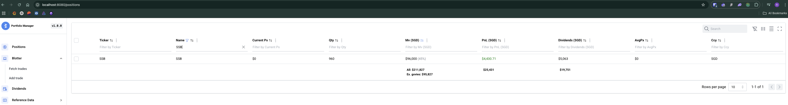
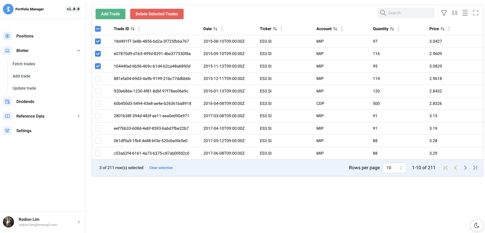
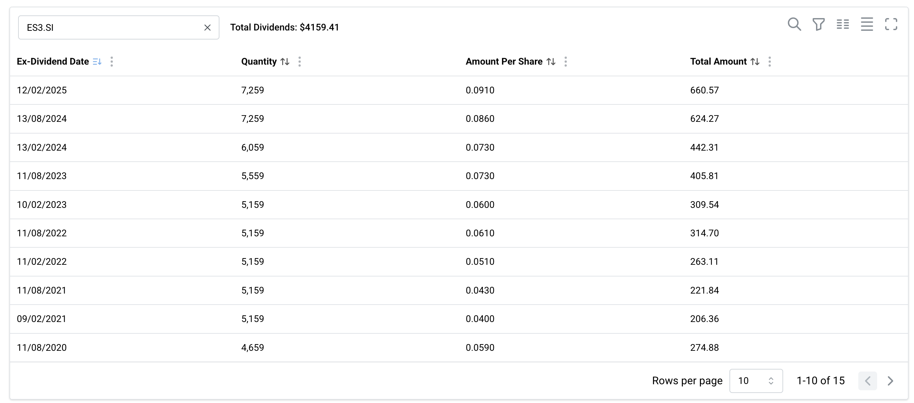
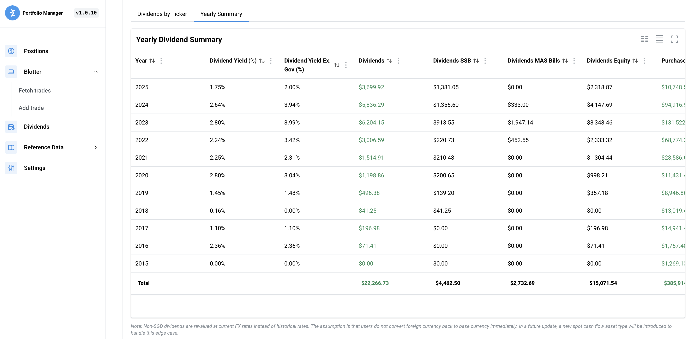
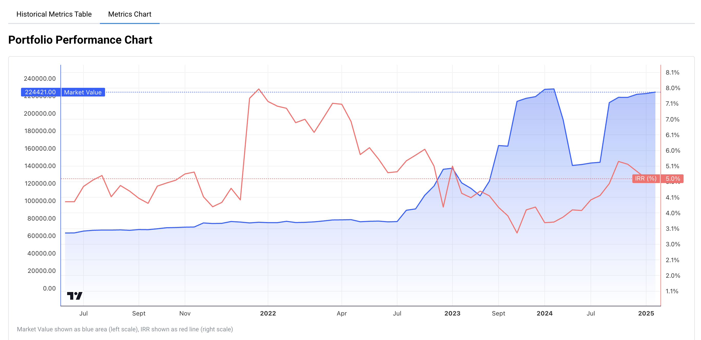
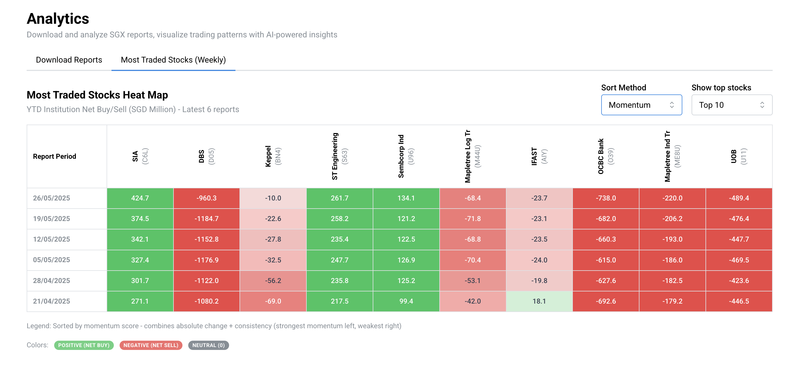
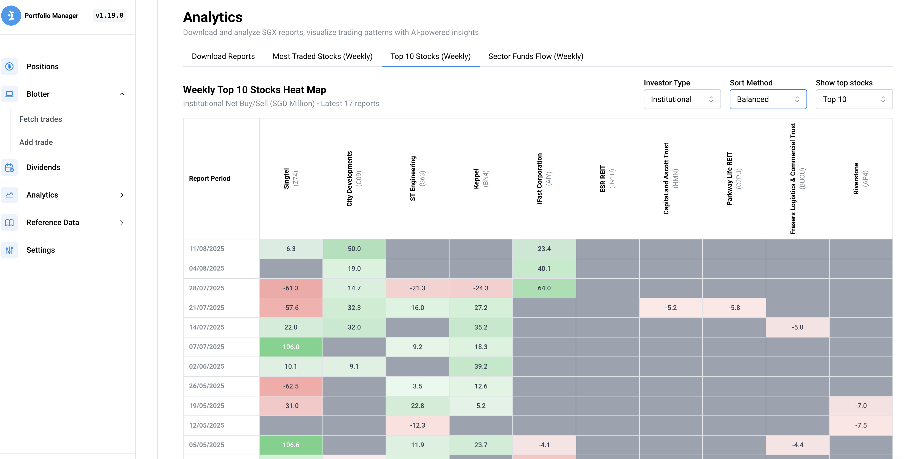
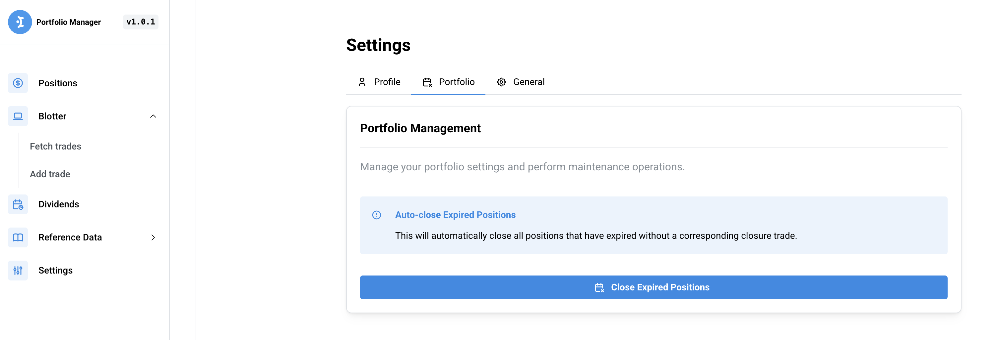

# Portfolio Manager

[](https://github.com/rodionlim/portfolio-manager-go/actions/workflows/ci.yml) [](https://github.com/rodionlim/portfolio-manager-go/blob/main/VERSION)

An application to value equities, fx, commodities, cash, bonds (corps / gov), and cryptocurrencies in your personal portfolio and use LLMs to generate trading insights.

## Features

- Value assets of different currencies based on current market prices
- Fetch market data based on free data sources (Yahoo finance, Google finance, dividends.sg, ilovessb.com, mas, nasdaq), current and historical
- Import / Export portfolio blotter data using CSV file for easy migration to other portfolio systems
- Allow users to supply their own custom dividends metadata
- Export ticker reference data in yaml format
- Autoclosing expired positions
- Infer historical fx rates for blotter trades
- Store portfolio, reference, dividends and coupon data in leveldb for persistence
- Display detailed information for individual and aggregated assets
- Collect and display portfolio statistics such as IRR, MV, Price Paid
- Integration with Gemini to derive trading insights via Analytics module
- OpenAPI compliant for easy integration with other systems
- UI for end users
- Cloud and Local backup and restore (Google Drive)
- MCP (Model Context Protocol) server for LLM integration

## Installation

1. Install Go version <b>1.24.3</b> or higher.
2. Clone the repository to your local machine.
3. Run `make` to build and install the application
4. Run the `portfolio-manager` binary to start the application. Pass in config flag `-config custom-config.yaml`

### Environment Variables

The application supports the following environment variables:

- `GEMINI_API_KEY`: API key for Google Gemini AI service (used for SGX report analysis). If set, this will override the `geminiApiKey` setting in the config file.

- `ANALYTICS_SCHEDULE`: Cron expression for scheduling the collection of SGX Reports, If set, this will override the `analytics.schedule` settings in the config file.

### Proxmox VE Helper Scripts

For home-labbers, helpers scripts are exposed to allow easy installation of `portfolio-manager` in lxc containers within Proxmox VE.

```sh
bash -c "$(wget -qLO - https://github.com/rodionlim/portfolio-manager-go/raw/main/lxc/portfolio-manager.sh)"
```

#### Setting Environment Variables in Proxmox

For Proxmox deployments, you can set environment variables directly in the systemd unit file. After installation, edit the service file:

```sh
# Edit the systemd service file
sudo systemctl edit PortfolioManager --full

# Check environment variables file in the [Service] section:
[Service]
EnvironmentFile=/etc/sysconfig/PortfolioManager

# Create an env file with the following
GEMINI_API_KEY=your_api_key_here

# Reload and restart the service
sudo systemctl daemon-reload
sudo systemctl restart PortfolioManager
```

## Quickstart

Start the application

```sh
make run # only start application backend
make run-full # if user wants to start with the UI, run this command instead
```

For Developers

```sh
make run # start backend
cd web/ui && npm run dev # start ui with hot reload on http://localhost:5173
```

Build the application

```sh
make
```

Wipe the entire database

```sh
make clean-db
```

Tests

```sh
make test # unit tests
make test-integration # integration tests
```

## CLI Commands

The portfolio-manager binary includes CLI commands for interacting with a local/remote server, database backup and restore operations:

#### List all positions

```sh
./portfolio-manager position-list
```

#### Delete a specific position

```sh
./portfolio-manager position-delete <book> <ticker>
```

#### Specify custom server URL

```sh
./portfolio-manager --url=http://localhost:8080 position-list
./portfolio-manager --url=http://localhost:8080 position-delete "Rodion" "AAPL"
```

### Database Backup

**Note:** Backup and Restore commands only work for a **local** portfolio-manager server because they require direct access to the database files on disk. To backup a remote server, run these commands locally on that server (e.g., via SSH).

Create a backup of the database:

```sh
./portfolio-manager backup --source [local|gdrive|nextcloud] --uri [path|url] --user [username] --password [password] --include-data [true|false]
```

**Parameters:**

- `--source`: Backup destination (local, gdrive, nextcloud)
- `--uri`: File location or URL (required for local and nextcloud)
- `--user`: Credentials filepath for remote sources (gdrive, nextcloud)
- `--password`: Password for remote sources (nextcloud)
- `--include-data`: Include the data folder (funds flow, reports etc.) in the backup (default: true)

**Examples:**

```sh
# Local backup to ./backups directory
./portfolio-manager backup --source local --uri ./backups

# Local backup to specific directory
./portfolio-manager backup --source local --uri /path/to/backup/location

# Google Drive backup (service account)
./portfolio-manager backup --source gdrive --user ./credentials.json

**Note on Google Drive Service Accounts:**
Service accounts do not have their own storage quota. To use GDrive backup:
1. Create a folder in your personal Google Drive (e.g., `portfolio-backups`).
2. Share that folder with the `client_email` found in your `credentials.json` file.
3. Grant the email **Editor** permissions.
4. Pass the folder name via `--uri`:
   `./portfolio-manager backup --source gdrive --user ./credentials.json --uri portfolio-backups`

# Google Drive backup (personal account with OAuth2)
./portfolio-manager backup --source gdrive --user ./credentials.json

**Note on Google Drive OAuth2:**
If you are using a personal Google account, use OAuth2 Desktop credentials instead of a Service Account to avoid storage quota issues.
1. Create an **OAuth 2.0 Client ID** of type **Desktop App** in Google Cloud Console.
2. Download the JSON file and use it with the `--user` flag.
3. **Important**: Google has blocked the out-of-band (OOB) "copy-paste" flow. The application now uses a local loopback server on port **8888** for authentication.
4. Ensure your **OAuth Client ID** in Google Console allows `http://localhost:8888` as a redirect URI (though for Desktop App types, localhost is usually allowed by default).
5. On first run, follow the link in your terminal. After authorization, you will be redirected to the URI specified in your `credentials.json` (e.g., `http://localhost:8888` or your Tailscale domain) and the application will capture the code automatically.
6. A `token.json` will be saved locally for future automatic backups.
7. **Remote Servers (Proxmox/LXC)**: If you are running the app on a remote server, you have two options for the one-time authentication step:
   - **Option A (Custom Domain)**: Use a reachable domain in your `redirect_uris` (like a Tailscale `.ts.net` address). Ensure port **8888** (or the port in your URI) is open in your server firewall. (*Note: Only works for "Web Application" client types, not "Desktop App"*).
   - **Option B (Port Forwarding)**: Keep `localhost:8888` in your credentials and "beam" the traffic from your local laptop to the server using one of these commands on your **local machine**:
     - **SSH Tunnel**: `ssh -L 8888:localhost:8888 your-server`
     - **Socat**: `socat TCP4-LISTEN:8888,fork TCP4:your-server:8888`

# Nextcloud backup (not yet implemented)
./portfolio-manager backup --source nextcloud --uri https://your-nextcloud.com --user username --password password
```

### Database Restore

Restore database from a backup:

```sh
./portfolio-manager restore-from-backup --source [local|gdrive|nextcloud] --uri [path|url] --user [username] --password [password]
```

**Important:** The application must be stopped before restoring from backup. The restore operation will completely replace the existing database.

**Examples:**

```sh
# Restore from local backup file
./portfolio-manager restore-from-backup --source local --uri ./backups/portfolio-manager-backup-20240101-120000.tar.gz

# Restore from Google Drive
# 1. Automatic: If no filename is specified (just the folder), the latest backup is selected
./portfolio-manager restore-from-backup --source gdrive --user ./credentials.json --uri portfolio-backups

# 2. Manual: Specify a specific backup file in the folder
./portfolio-manager restore-from-backup --source gdrive --user ./credentials.json --uri portfolio-backups/portfolio-manager-backup-20240101-120000.tar.gz

# Restore from Nextcloud (not yet implemented)
./portfolio-manager restore-from-backup --source nextcloud --uri https://your-nextcloud.com --user username --password password
```

### Version Information

Display version information:

```sh
./portfolio-manager -v
# or
./portfolio-manager --version
```

### Backup and Restore in Proxmox Environment

For users running portfolio-manager in a Proxmox LXC container:

**Creating a Backup:**

1. Stop the portfolio-manager service:

   ```sh
   sudo systemctl stop PortfolioManager
   ```

2. Create the backup:

   ```sh
   cd /opt/PortfolioManager
   ./portfolio-manager backup --source local --uri /backup/portfolio-manager
   ```

3. Restart the service:
   ```sh
   sudo systemctl start PortfolioManager
   ```

**Restoring from a Backup:**

1. Stop the portfolio-manager service:

   ```sh
   sudo systemctl stop PortfolioManager
   ```

2. Restore the database:

   ```sh
   cd /opt/PortfolioManager
   ./portfolio-manager restore-from-backup --source local --uri /backup/portfolio-manager/portfolio-manager-backup-YYYYMMDD-HHMMSS.tar.gz
   ```

3. Restart the service:
   ```sh
   sudo systemctl start PortfolioManager
   ```

**Note:** Always ensure you have recent backups before performing restore operations. Backups from different versions may not be compatible.

## Project Structure

```
portfolio-manager/
├── cmd/
│   └── portfolio/
│       └── main.go
├── docs/
│   └── swagger.json
├── internal/
│   ├── analytics/
│   ├── blotter/
│   ├── config/
│   ├── dal/
│   ├── dividends/
│   ├── fxinfer/
│   ├── historical/
│   ├── metrics/
│   ├── migrations/
│   ├── mocks/
│   ├── portfolio/
│   └── server/
│       ├── server.go    # Main HTTP server
│       └── mcp.go       # MCP server integration
├── lxc/
├── pkg/
│   ├── common/
│   ├── csvutil/
│   ├── event/
│   ├── logging/
│   ├── mdata/
│   │   └── sources/
│   ├── rdata/
│   ├── scheduler/
│   └── types/
├── templates/
│   └── blotter_import.csv # Sample for users to reference when trying to import blotter trades via csv
│   └── dividends_metadata_import.csv # Sample for users to reference when inserting custom dividends
├── web/
├── .gitignore
├── go.mod
└── README.md
```

## For Developers

### Testing and Mocking Strategy

This project uses the `testify` framework for testing and mocking. While there are two different mocking approaches in this codebase:

1. **Testify-based mocks** (preferred): Located in `internal/mocks/testify/` directory
2. **Custom mocks**: Located in `internal/mocks/` directory

When writing new tests or modifying existing ones, please **use the testify mocks** instead of the custom mock implementation.

Example:

```go
// Import testify mocks (preferred)
import "portfolio-manager/internal/mocks/testify"

// Create a mock
mockService := new(testify.MockService)
mockService.On("MethodName", arg1, arg2).Return(expectedResult)

// Later verify expectations
mockService.AssertExpectations(t)
```

## MCP Server Integration

This project includes a **Model Context Protocol (MCP) server** that enables Large Language Models (LLMs) to interact directly with your portfolio data. This allows you to query your portfolio using natural language through compatible LLM interfaces.

### Configuration

Enable the MCP server by setting the following in your `config.yaml`:

```yaml
mcp:
  enabled: true
  port: 8081
```

### Available Tools

The MCP server provides the following tools for LLM interaction:

#### 1. Query Blotter Trades (`query_blotter_trades`)

Query your trading history with flexible filtering options:

- **ticker**: Filter by specific ticker symbol
- **start_date**: Filter trades from a specific date (YYYY-MM-DD format)
- **end_date**: Filter trades up to a specific date (YYYY-MM-DD format)
- **trade_type**: Filter by trade type (BUY or SELL)
- **limit**: Limit the number of results (default: 100)

#### 2. Get Portfolio Positions (`get_portfolio_positions`)

Retrieve current portfolio positions with market values and P&L:

- **book**: Filter by specific book/account (optional, returns all books if not specified)

#### 3. Delete Portfolio Position (`delete_portfolio_position`)

Destructive operation. The agent MUST obtain explicit user confirmation before calling with `confirm="yes"`.

Example tool call payload (conceptual):

```jsonc
{
  "name": "delete_portfolio_position",
  "arguments": {
    "book": "main",
    "ticker": "AAPL",
    "confirm": "yes" // only after user confirms
  }
}
```

#### 4. Fetch Benchmark Interest Rates (`fetch_benchmark_interest_rates`)

Fetch benchmark interest rates for a specific country:

- **country**: Country code (e.g., 'SG' for Singapore) **[Required]**
- **points**: Number of data points to fetch (default: 100)

### Usage Examples

Once configured and running, you can interact with your portfolio data through any MCP-compatible LLM interface. Example queries:

- "Show me all my Apple trades from last month"
- "What are my current positions in the tech book?"
- "List all sell trades for the past quarter"
- "Show me my portfolio positions with current market values"
- "Fetch the latest benchmark interest rates for Singapore"
- "Delete portfolio position for main book and ticker SBAUG24

### Potential Use Cases

The MCP server opens up numerous possibilities for LLM-powered portfolio analysis:

#### **Real-time Portfolio Queries**

- Ask natural language questions about your holdings
- Get instant summaries of positions, P&L, and performance
- Query specific trades or transactions with flexible criteria

#### **Investment Research & Analysis**

- Analyze trading patterns and performance trends
- Generate custom reports and summaries

#### **Risk Management**

- Monitor portfolio concentration and exposure
- Identify underperforming positions or sectors

The MCP server essentially transforms your portfolio manager into an AI-queryable database, making your investment data accessible through natural language interfaces and enabling sophisticated AI-powered analysis workflows.

## Built-in Scheduler (Cron-based)

This project includes a flexible, cron-based scheduler component that can be used by any package to trigger jobs at specific times or intervals. The scheduler supports standard 5-field cron expressions, enabling developers to easily schedule tasks such as data collection, reporting, or maintenance jobs.

### Key Features

- Schedule any Go function or job using a cron expression (minute, hour, day of month, month, day of week)
- Reusable across the codebase for any periodic or time-based automation
- Powered by the robust [robfig/cron](https://pkg.go.dev/github.com/robfig/cron/v3) library

### Example Use Case: Metrics Collection

Portfolio metrics collection is scheduled using the built-in scheduler. For example, to collect metrics every day at midnight:

```
service.StartMetricsCollection("0 0 * * *") // Every day at midnight
```

Or, to collect every 5 minutes:

```
service.StartMetricsCollection("*/5 * * * *")
```

You can use the scheduler in your own packages to trigger any job on a schedule:

```
sched, _ := scheduler.NewCronSchedule("0 9 * * MON") // Every Monday at 9:00 AM
scheduler.ScheduleTaskFunc(myJobFunc, sched)
```

### Cron Expression Format

A cron expression consists of five fields:

```
* * * * *
| | | | |
| | | | +----- day of week (0 - 6) (Sunday=0)
| | | +------- month (1 - 12)
| | +--------- day of month (1 - 31)
| +----------- hour (0 - 23)
+------------- minute (0 - 59)
```

#### Examples

| Cron Expression | Schedule Description               |
| --------------- | ---------------------------------- |
| \* \* \* \* \*  | Every minute                       |
| 0 \* \* \* \*   | Every hour                         |
| 0 0 \* \* \*    | Every day at 12:00 AM              |
| 0 0 \* \* FRI   | At 12:00 AM, only on Friday        |
| 0 0 1 \* \*     | At 12:00 AM, on day 1 of the month |

For more details, see [crontab.guru](https://crontab.guru/) or the [robfig/cron](https://pkg.go.dev/github.com/robfig/cron/v3) Go library documentation.

## UI

### Positions

Users can get an aggregated view of all their positions via the positions component in the user interface.



### Blotter Table

User can add, delete and update trades via the blotter component in the user interface.



### Dividends Table

User can view dividends history of any given ticker at a granular level by ex-date



### Dividends Summary

User can view aggregated dividends by year with more details such as dividend yield etc.



### Metrics Chart

Users can visualize portfolio performance over time with both market value and IRR (Internal Rate of Return) plotted together.



### Analytics Heat Map

Users can visualize the most commonly traded stocks using a heat map showing institutional net buy/sell values with customizable sorting methods and stock selection.

 (DEPRECATED)


#### Sorting Methods

The heat map supports three different sorting methods:

1. **Absolute**: Sorts stocks by their absolute YTD institutional net buy/sell amounts (highest absolute values first)

2. **Percentage**: Sorts stocks by percentage change from the earliest to latest report period

3. **Momentum**: Sorts stocks by a momentum score that combines both absolute change and consistency

#### Momentum Calculation

The momentum score is calculated using the following formula:

```
Momentum Score = (Absolute Change × 0.7) + (Consistency Score × |Absolute Change| × 0.3)
```

Where:

- **Absolute Change**: Latest YTD value - Earliest YTD value
- **Consistency Score**: Ratio of periods showing positive trend (0 to 1)
  - Calculated as: Number of periods with positive change ÷ Total periods
  - A stock with consistent upward movement across all periods gets a score of 1.0
  - A stock with no positive periods gets a score of 0.0

**Example**: If a stock has:

- Absolute change of +50M SGD
- Positive movement in 8 out of 10 periods (consistency = 0.8)

Then: Momentum Score = (50 × 0.7) + (0.8 × 50 × 0.3) = 35 + 12 = 47

This approach prioritizes stocks with both significant absolute changes and consistent directional movement, helping identify stocks with strong institutional buying/selling momentum rather than just one-time large movements.

### Settings

User can edit application wide settings, such as auto closing expired positions via the user interface



## Backend API - Sample Curl Commands

All API calls are documented (OAS) under `http://localhost:8080/swagger/index.html`

### Get Blotter Trades

```sh
curl http://localhost:8080/api/v1/blotter/trades
```

### Add Asset to Blotter

```sh
curl -X POST http://localhost:8080/api/v1/blotter/trade \
    -H "Content-Type: application/json" \
    -d '{
        "ticker": "AAPL",
        "side": "buy",
        "broker": "DBS",
        "book": "BookA",
        "account": "CDP",
        "quantity": 10,
        "price": 150.00,
        "fx": 1.33,
        "type": "buy",
        "tradeDate": "2024-12-09T00:00:00Z"
    }'
```

### Update Asset in Blotter

```sh
curl -X PUT http://localhost:8080/api/v1/blotter/trade \
    -H "Content-Type: application/json" \
    -d '{
        "ticker": "AAPL",
        "side": "buy",
        "broker": "DBS",
        "book": "BookA",
        "account": "CDP",
        "quantity": 10,
        "price": 200.00,
        "fx": 1,
        "type": "buy",
        "tradeDate": "2024-12-09T00:00:00Z"
    }'
```

### Delete Assets from Blotter

```sh
curl -X DELETE http://localhost:8080/api/v1/blotter/trade \
    -H "Content-Type: application/json" \
    -d '["61570b49-2adb-4b99-be20-d14001e761a9"]'
```

### Delete all Assets from Blotter and Positions

```sh
curl -X DELETE http://localhost:8080/api/v1/blotter/trade/all
curl -X DELETE http://localhost:8080/api/v1/portfolio/positions
```

### Import Trades from CSV (for migrating into portfolio-manager)

Note that FX rate here is always with respect to portfolio revaluation currency per foreign ccy, e.g. USD/SGD if SGD is portfolio revaluation currency

```sh
curl -X POST http://localhost:8080/api/v1/blotter/import \
  -F "file=@templates/blotter_import.csv"
```

### Export Trades to a CSV (for migrating out of portfolio-manager)

```sh
curl -X GET http://localhost:8080/api/v1/blotter/export
```

### Export Trades with Inferred FX Rates

Export trades with FX rates automatically inferred for trades where FX rate is missing. This amends the blotter in memory as well. Users should wipe all blotter trades and reimport the amended blotter if they want it to be persisted across restarts.

```sh
curl -X GET http://localhost:8080/api/v1/blotter/export-with-fx
```

### Get Portfolio Positions

```sh
curl http://localhost:8080/api/v1/portfolio/positions
```

### Get Portfolio Positions (Lite)

Get positions without enrichment (no FX rates, dividends, or market values). Useful for UI components that only need ticker information and want faster response times.

```sh
curl http://localhost:8080/api/v1/portfolio/positions/lite
```

### Delete Single Position

Delete a specific position by book and ticker:

```sh
curl -X DELETE "http://localhost:8080/api/v1/portfolio/position?book=Rodion&ticker=SBAUG24"
```

### Get Current FX Rates for relevant currencies in our blotter

Get current FX rates for all currencies in the blotter. Returns a JSON mapping of currencies to their current exchange rates relative to the base currency.

```sh
curl -X GET http://localhost:8080/api/v1/blotter/fx
```

### View Blotter Trades

```sh
curl -X GET http://localhost:8080/api/v1/blotter/trade
```

### View Positions

```sh
curl -X GET http://localhost:8080/api/v1/portfolio/positions
```

### Portfolio Metrics

Get portfolio metrics (IRR, Market Value, Price Paid) for the entire portfolio:

```sh
curl -X GET http://localhost:8080/api/v1/metrics
```

Get portfolio metrics filtered by a specific book:

```sh
curl -X GET "http://localhost:8080/api/v1/metrics?book_filter=tactical"
```

### Fetch Asset Prices

```sh
curl -X GET http://localhost:8080/api/v1/mdata/price/es3.si
curl -X GET http://localhost:8080/api/v1/mdata/price/temb
curl -X GET http://localhost:8080/api/v1/mdata/price/eth-usd
curl -X GET http://localhost:8080/api/v1/mdata/price/usd-sgd
```

### Fetch Historical Price Data

```sh
# Get historical price data from January 1, 2024 to current date
curl -X GET "http://localhost:8080/api/v1/mdata/price/historical/AAPL?start=20240101"

# Get historical price data for a specific date range
curl -X GET "http://localhost:8080/api/v1/mdata/price/historical/ES3.SI?start=20240101&end=20240501"
```

### Fetch Historical FX Rates

Get historical foreign exchange rates for currency pairs. This is particularly useful for retrieving FX rates for specific trade dates when adding blotter entries with foreign currency assets.

```sh
# Get USD-SGD FX rate for a specific date (YYYYMMDD format)
curl -X GET "http://localhost:8080/api/v1/mdata/price/historical/USD-SGD?start=20250602&end=20250602"

# Get JPY-SGD FX rate for the last month
curl -X GET "http://localhost:8080/api/v1/mdata/price/historical/JPY-SGD?start=20240401&end=20240430"
```

### Fetch Dividends

```sh
# equity - refer to ticker reference for identifier
curl -X GET http://localhost:8080/api/v1/mdata/dividends/es3.si
curl -X GET http://localhost:8080/api/v1/mdata/dividends/aapl

# ssb - format SBMMMYY
curl -X GET http://localhost:8080/api/v1/mdata/dividends/sbjul24

# mas bill
curl -X GET http://localhost:8080/api/v1/mdata/dividends/bs24124z
```

### Delete Dividends

```sh
# Delete custom dividends for AAPL
curl -X DELETE "http://localhost:8080/api/v1/mdata/dividends/AAPL?type=Custom"

# Delete official dividends
curl -X DELETE "http://localhost:8080/api/v1/mdata/dividends/C2PU.SI?type=Official"
```

### Store Custom Dividends

Note that customa dividends are concatenated against official dividends. Custom dividends always take precedence over official dividends, in case official figures are wrong. If official date is wrong, we can always input a dividend with value of 0.

```sh
curl -X POST http://localhost:8080/api/v1/mdata/dividends/AAPL \
  -H "Content-Type: application/json" \
  -d '[
    {
      "ExDate": "2024-11-10",
      "Amount": 120.00,
      "AmountPerShare": 0.24,
      "Qty": 500
    },
    {
      "ExDate": "2024-08-09",
      "Amount": 115.00,
      "AmountPerShare": 0.23,
      "Qty": 500
    }
  ]'
```

### Fetch Portfolio Dividends

Single Ticker

```sh
curl -X GET http://localhost:8080/api/v1/dividends/cjlu.si
```

All Tickers

```sh
curl -X GET http://localhost:8080/api/v1/dividends
```

### Fetch Benchmark Interest Rates

Get default number of Singapore interest rates (250 records)

```sh
curl -X GET "http://localhost:8080/api/v1/mdata/interest-rates/SG"
```

Get specific number of records

```sh
curl -X GET "http://localhost:8080/api/v1/mdata/interest-rates/SG?points=5"
```

### Fetch Reference Data

```sh
curl -X GET http://localhost:8080/api/v1/refdata
```

## Import Reference Data (YAML)

You can import reference data from a YAML file using the following endpoint:

```
curl -X POST \
  -F "file=@seed/refdata.yaml" \
  http://localhost:8080/api/v1/refdata/import
```

- Replace `seed/refdata.yaml` with the path to your YAML file if different.
- The response will indicate how many tickers were inserted or updated.

### Historical Portfolio Metrics

Get all historical metrics:

```sh
curl -X GET http://localhost:8080/api/v1/historical/metrics
```

Export historical metrics as CSV: (takes in book_filter as an optional query parameter)

```sh
curl -X GET http://localhost:8080/api/v1/historical/metrics/export
```

Import historical metrics from CSV file:

```sh
curl -X POST http://localhost:8080/api/v1/historical/metrics/import \
  -F "file=@/path/to/historical_metrics_import.csv"
```

Insert or update a historical metric:

```sh
curl -X POST http://localhost:8080/api/v1/historical/metrics \
  -H "Content-Type: application/json" \
  -d '{
    "timestamp": "2024-05-15T00:00:00Z",
    "metrics": {
      "irr": 0.12,
      "pricePaid": 50000,
      "mv": 55000,
      "totalDividends": 1200
    }
  }'
```

Insert or update a historical metric for a specific book:

```sh
curl -X POST "http://localhost:8080/api/v1/historical/metrics?book_filter=tactical" \
  -H "Content-Type: application/json" \
  -d '{
    "timestamp": "2024-05-15T00:00:00Z",
    "metrics": {
      "irr": 0.12,
      "pricePaid": 50000,
      "mv": 55000,
      "totalDividends": 1200
    }
  }'
```

Delete historical metrics:

```sh
curl -X POST http://localhost:8080/api/v1/historical/metrics/delete \
  -H "Content-Type: application/json" \
  -d '{
    "timestamps": [
      "2024-05-15T00:00:00Z",
      "2024-06-15T00:00:00Z"
    ]
  }'
```

Delete historical metrics for a specific book:

```sh
curl -X POST "http://localhost:8080/api/v1/historical/metrics/delete?book_filter=tactical" \
  -H "Content-Type: application/json" \
  -d '{
    "timestamps": [
      "2024-05-15T00:00:00Z",
      "2024-06-15T00:00:00Z"
    ]
  }'
```

### Historical Metrics Jobs (Custom Scheduling)

Create a custom metrics collection job for a specific book, using the default schedule (Same as entire portfolio):

```sh
curl -X POST http://localhost:8080/api/v1/historical/metrics/jobs \
  -H "Content-Type: application/json" \
  -d '{
    "cronExpr": "",
    "bookFilter": "tactical"
  }'
```

List all custom metrics jobs:

```sh
curl -X GET http://localhost:8080/api/v1/historical/metrics/jobs
```

List all metrics jobs (including portfolio job for UI):

```sh
curl -X GET http://localhost:8080/api/v1/historical/metrics/jobs/all
```

Delete a custom metrics job:

```sh
curl -X DELETE http://localhost:8080/api/v1/historical/metrics/jobs/tactical
```

Manually trigger metrics collection for entire portfolio:

```sh
curl -X POST http://localhost:8080/api/v1/historical/metrics/trigger \
  -H "Content-Type: application/json" \
  -d '{
    "bookFilter": ""
  }'
```

Manually trigger metrics collection for a specific book:

```sh
curl -X POST http://localhost:8080/api/v1/historical/metrics/trigger \
  -H "Content-Type: application/json" \
  -d '{
    "bookFilter": "tactical"
  }'
```

### Add Reference Data

```sh
curl -X POST http://localhost:8080/api/v1/refdata \
  -H "Content-Type: application/json" \
  -d '{
        "id": "ES3.SI",
        "name": "STI ETF",
        "underlying_ticker": "ES3.SI",
        "yahoo_ticker": "ES3.SI",
        "dividends_sg_ticker": "ES3",
        "asset_class": "eq",
        "asset_sub_class": "etf",
        "ccy": "SGD",
        "domicile": "SG"
      }'
```

### Delete Reference Data

```sh
curl -X DELETE http://localhost:8080/api/v1/refdata \
    -H "Content-Type: application/json" \
    -d '["ES3.SI"]'
```

### Export Reference Data

```sh
curl -X GET http://localhost:8080/api/v1/refdata/export
```

### Force a compute of dividends for a ticker across the entire blotter

```sh
curl -X POST http://localhost:8080/api/v1/dividends -H "Content-Type: application/json" -d '{"ticker": "ES3.SI"}'
```

### Autoclose expired positions

Tbills, SSB that has expired should have a corresponding "sell" blotter entry that can be infered automatically based on the reference data

```sh
curl -X POST http://localhost:8080/api/v1/portfolio/cleanup
```

### Get Portfolio Metrics, e.g. IRR (Internal Rate of Return), Price Paid, MV, Total Dividends

Get portfolio metrics such as Internal Rate of Return (IRR) for the entire portfolio. Returns the calculated IRR and other metrics as a JSON object.

```sh
curl -X GET http://localhost:8080/api/v1/metrics
```

### Fetch Historical Portfolio Metrics

Fetch all historical portfolio metrics (date-stamped portfolio metrics).

```sh
curl -X GET http://localhost:8080/api/v1/historical/metrics
```

Fetch historical portfolio metrics filtered by book:

```sh
curl -X GET "http://localhost:8080/api/v1/historical/metrics?book_filter=tactical"
```

### Import Historical Portfolio Metrics from CSV

Import historical portfolio metrics (date-stamped portfolio metrics) from a CSV file. The CSV should have the following headers:

```
Date,IRR,PricePaid,MV,TotalDividends
```

Sample file: `templates/historical_metrics_import.csv`

```sh
curl -X POST http://localhost:8080/api/v1/historical/metrics/import \
  -F "file=@templates/historical_metrics_import.csv"
```

### Export Historical Portfolio Metrics to CSV

Export all historical portfolio metrics as a CSV file.

```sh
curl -X GET http://localhost:8080/api/v1/historical/metrics/export -o historical_metrics_export.csv
```

### Upsert (Insert/Update) a Single Historical Portfolio Metric

Insert or update a single historical portfolio metric (date-stamped portfolio metric) using POST or PUT. Update is keyed on timestamp date. The JSON should match the `TimestampedMetrics` structure:

```
{
  "timestamp": "2025-05-11T00:00:00Z",
  "metrics": {
    "irr": 0.2,
    "pricePaid": 10000,
    "mv": 12000,
    "totalDividends": 500
  }
}
```

Sample curl (insert or update):

```sh
curl -X POST http://localhost:8080/api/v1/historical/metrics \
  -H "Content-Type: application/json" \
  -d '{
    "timestamp": "2025-05-11T00:00:00Z",
    "metrics": {"irr": 0.2, "pricePaid": 10000, "mv": 12000, "totalDividends": 500}
  }'

curl -X PUT http://localhost:8080/api/v1/historical/metrics \
  -H "Content-Type: application/json" \
  -d '{
    "timestamp": "2025-05-11T00:00:00Z",
    "metrics": {"irr": 0.2, "pricePaid": 10000, "mv": 12000, "totalDividends": 500}
  }'
```

Sample curl (insert or update for a specific book):

```sh
curl -X POST "http://localhost:8080/api/v1/historical/metrics?book_filter=tactical" \
  -H "Content-Type: application/json" \
  -d '{
    "timestamp": "2025-05-11T00:00:00Z",
    "metrics": {"irr": 0.2, "pricePaid": 10000, "mv": 12000, "totalDividends": 500}
  }'

curl -X PUT "http://localhost:8080/api/v1/historical/metrics?book_filter=tactical" \
  -H "Content-Type: application/json" \
  -d '{
    "timestamp": "2025-05-11T00:00:00Z",
    "metrics": {"irr": 0.2, "pricePaid": 10000, "mv": 12000, "totalDividends": 500}
  }'
```

See also: Import/Export endpoints for batch operations.

### Analytics - SGX Report Analysis

Fetch, download and analyze the latest SGX report of a specific type with AI Insight:

```sh
curl -X GET "http://localhost:8080/api/v1/analytics/latest?type=fund%20flow"
```

List all downloaded SGX reports

```sh
curl -X GET http://localhost:8080/api/v1/analytics/list_files
```

Analyze an existing file in the data directory:

```sh
curl -X POST http://localhost:8080/api/v1/analytics/analyze \
  -H "Content-Type: application/json" \
  -d '{
    "filePath": "./data/SGX_Fund_Flow_Weekly_Tracker_Week_of_26_May_2025.xlsx"
  }'
```

List all stored analysis results:

```sh
curl -X GET http://localhost:8080/api/v1/analytics/list_analysis
```

Download the latest N SGX reports:

```sh
curl -X GET "http://localhost:8080/api/v1/analytics/download?n=5"
```

Download the latest N SGX reports filtered by type:

```sh
curl -X GET "http://localhost:8080/api/v1/analytics/download?n=3&type=fund%20flow"
```

Analyze the latest N SGX reports filtered by type:

```sh
curl -X GET "http://localhost:8080/api/v1/analytics/analyze_latest?n=3&type=fund%20flow"
```

Analyze the latest N SGX reports with force reanalysis (This will use additional API limits unnecessarily):

```sh
curl -X GET "http://localhost:8080/api/v1/analytics/analyze_latest?n=3&type=fund%20flow&force=true"
```

Extract 100 Most Traded Stocks data from latest SGX Fund Flow Weekly Tracker reports:

```sh
# Get all available reports
curl -X GET http://localhost:8080/api/v1/analytics/most_traded_stocks # DEPRECATED
curl -X GET http://localhost:8080/api/v1/analytics/top10_stocks

# Get only the latest 2 reports
curl -X GET "http://localhost:8080/api/v1/analytics/most_traded_stocks?n=2"
curl -X GET http://localhost:8080/api/v1/analytics/top10_stocks?n=2
```

Extract Institutional sector funds flow data from latest SGX Fund Flow Weekly Tracker reports:

```sh
# Get all available sector funds flow reports
curl -X GET http://localhost:8080/api/v1/analytics/sector_funds_flow

# Get only the latest 3 reports
curl -X GET "http://localhost:8080/api/v1/analytics/sector_funds_flow?n=3"
```

### Get User Profile

```sh
curl http://localhost:8080/api/v1/user/profile
```

### Update User Profile

```sh
curl -X PUT http://localhost:8080/api/v1/user/profile \
    -H "Content-Type: application/json" \
    -d '{
        "username": "John Doe",
        "email": "john@example.com",
        "avatar": "https://example.com/avatar.png"
    }'
```

### Health Check

```sh
curl http://localhost:8080/healthz
```

## Configurations

Sample configurations

```yaml
verboseLogging: true
logFilePath: ./portfolio-manager.log
host: localhost
port: 8080
baseCcy: SGD
db: leveldb
dbPath: ./portfolio-manager.db
refDataSeedPath: "./seed/refdata.yaml"
mcp:
  enabled: false # Enable/disable MCP server
  port: 8081 # MCP server port
dividends:
  divWitholdingTaxSG: 0
  divWitholdingTaxUS: 0.3
  divWitholdingTaxHK: 0
  divWitholdingTaxIE: 0.15
metrics:
  schedule: "10 17 * * 1-5" # daily at 5:10pm, Mon-Fri (excludes weekends)
marketData:
  rateLimitMs: 750 # Minimum milliseconds between Yahoo Finance requests (increased from default 500ms to avoid rate limiting)
analytics:
  geminiApiKey: "" # Get from Google AI Studio - required for analytics features
  geminiModel: "gemini-2.0-flash-lite" # Gemini model to use (docs: https://ai.google.dev/gemini-api/docs/models)
  dataDir: "./data" # Directory to store downloaded SGX reports
  schedule: "0 17 * * 1" # Weekly on Mondays at 5:00 PM
```

## Roadmap

See https://github.com/rodionlim/portfolio-manager-go/milestones

## Contributing

Contributions are always welcome! If you have any suggestions or find a bug, please open an issue or submit a pull request.

## License

This project is licensed under the MIT License - see the [license](./LICENSE) file for details.
