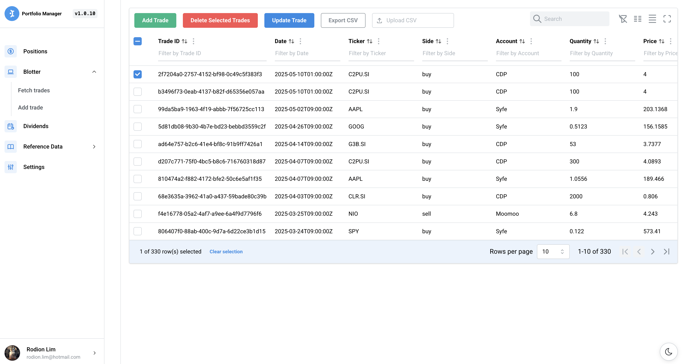

# Portfolio Valuation Tool

[](https://github.com/rodionlim/portfolio-manager-go/actions/workflows/ci.yml) [](https://github.com/rodionlim/portfolio-manager-go/blob/main/VERSION)

An application to value equities, fx, commodities, cash, bonds (corps / gov), and cryptocurrencies in your personal portfolio.

## Features

- Value assets of different currencies based on current market prices
- Fetch market data based on free data sources (Yahoo finance, Google finance, dividends.sg, ilovessb.com, mas), current and historical
- Import / Export portfolio blotter data using CSV file for easy migration to other portfolio systems
- Allow users to supply their own custom dividends metadata
- Export ticker reference data in yaml format
- Autoclosing expired positions
- Infer historical fx rates for blotter trades
- Store portfolio, reference, dividends and coupon data in leveldb for persistence
- Display detailed information for individual and aggregated assets
- OpenAPI compliant for easy integration with other systems
- UI for end users

## Installation

1. Install Go version <b>1.23.4</b> or higher.
2. Clone the repository to your local machine.
3. Run `make` to build and install the application
4. Run the `portfolio-manager` binary to start the application. Pass in config flag `-config custom-config.yaml`

### Proxmox VE Helper Scripts

For home-labbers, helpers scripts are exposed to allow easy installation of `portfolio-manager` in lxc containers within Proxmox VE.

```sh
bash -c "$(wget -qLO - https://github.com/rodionlim/portfolio-manager-go/raw/main/lxc/portfolio-manager.sh)"
```

## Quickstart

Start the application

```sh
make run # only start application backend
make run-full # if user wants to start with the UI, run this command instead
```

For Developers

```sh
make run # start backend
cd web/ui && npm run dev # start ui with hot reload on http://localhost:5173
```

Build the application

```sh
make
```

Wipe the entire database

```sh
make clean-db
```

Tests

```sh
make test # unit tests
make test-integration # integration tests
```

## Project Structure

```
portfolio-manager/
├── cmd/
│   └── portfolio/
│       └── main.go
├── docs/
│   └── swagger.json
├── internal/
│   ├── blotter/
│   ├── config/
│   ├── dal/
│   ├── dividends/
│   ├── fxinfer/
│   ├── historical/
│   ├── metrics/
│   ├── mocks/
│   ├── portfolio/
│   └── server/
├── lxc/
├── pkg/
│   ├── common/
│   ├── csvutil/
│   ├── event/
│   ├── logging/
│   ├── mdata/
│   │   └── sources/
│   ├── rdata/
│   ├── scheduler/
│   └── types/
├── templates/
│   └── blotter_import.csv # Sample for users to reference when trying to import blotter trades via csv
│   └── dividends_metadata_import.csv # Sample for users to reference when inserting custom dividends
├── web/
├── .gitignore
├── go.mod
└── README.md
```

## For Developers

### Testing and Mocking Strategy

This project uses the `testify` framework for testing and mocking. While there are two different mocking approaches in this codebase:

1. **Testify-based mocks** (preferred): Located in `internal/mocks/testify/` directory
2. **Custom mocks**: Located in `internal/mocks/` directory

When writing new tests or modifying existing ones, please **use the testify mocks** instead of the custom mock implementation.

Example:

```go
// Import testify mocks (preferred)
import "portfolio-manager/internal/mocks/testify"

// Create a mock
mockService := new(testify.MockService)
mockService.On("MethodName", arg1, arg2).Return(expectedResult)

// Later verify expectations
mockService.AssertExpectations(t)
```

## Built-in Scheduler (Cron-based)

This project includes a flexible, cron-based scheduler component that can be used by any package to trigger jobs at specific times or intervals. The scheduler supports standard 5-field cron expressions, enabling developers to easily schedule tasks such as data collection, reporting, or maintenance jobs.

### Key Features

- Schedule any Go function or job using a cron expression (minute, hour, day of month, month, day of week)
- Reusable across the codebase for any periodic or time-based automation
- Powered by the robust [robfig/cron](https://pkg.go.dev/github.com/robfig/cron/v3) library

### Example Use Case: Metrics Collection

Portfolio metrics collection is scheduled using the built-in scheduler. For example, to collect metrics every day at midnight:

```
service.StartMetricsCollection("0 0 * * *") // Every day at midnight
```

Or, to collect every 5 minutes:

```
service.StartMetricsCollection("*/5 * * * *")
```

You can use the scheduler in your own packages to trigger any job on a schedule:

```
sched, _ := scheduler.NewCronSchedule("0 9 * * MON") // Every Monday at 9:00 AM
scheduler.ScheduleTaskFunc(myJobFunc, sched)
```

### Cron Expression Format

A cron expression consists of five fields:

```
* * * * *
| | | | |
| | | | +----- day of week (0 - 6) (Sunday=0)
| | | +------- month (1 - 12)
| | +--------- day of month (1 - 31)
| +----------- hour (0 - 23)
+------------- minute (0 - 59)
```

#### Examples

| Cron Expression | Schedule Description               |
| --------------- | ---------------------------------- |
| \* \* \* \* \*  | Every minute                       |
| 0 \* \* \* \*   | Every hour                         |
| 0 0 \* \* \*    | Every day at 12:00 AM              |
| 0 0 \* \* FRI   | At 12:00 AM, only on Friday        |
| 0 0 1 \* \*     | At 12:00 AM, on day 1 of the month |

For more details, see [crontab.guru](https://crontab.guru/) or the [robfig/cron](https://pkg.go.dev/github.com/robfig/cron/v3) Go library documentation.

## UI

### Positions

Users can get an aggregated view of all their positions via the positions component in the user interface.


### Blotter Table

User can add, delete and update trades via the blotter component in the user interface.



### Dividends Table

User can view dividends history of any given ticker at a granular level by ex-date


### Dividends Summary

User can view aggregated dividends by year with more details such as dividend yield etc.


### Settings

User can edit application wide settings, such as auto closing expired positions via the user interface


## Backend API - Sample Curl Commands

All API calls are documented (OAS) under `http://localhost:8080/swagger/index.html`

### Add Asset to Blotter

```sh
curl -X POST http://localhost:8080/api/v1/blotter/trade \
    -H "Content-Type: application/json" \
    -d '{
        "ticker": "AAPL",
        "side": "buy",
        "broker": "DBS",
        "trader": "TraderA",
        "account": "CDP",
        "quantity": 10,
        "price": 150.00,
        "fx": 1.33,
        "type": "buy",
        "tradeDate": "2024-12-09T00:00:00Z"
    }'
```

### Update Asset in Blotter

```sh
curl -X PUT http://localhost:8080/api/v1/blotter/trade \
    -H "Content-Type: application/json" \
    -d '{
        "ticker": "AAPL",
        "side": "buy",
        "broker": "DBS",
        "trader": "TraderA",
        "account": "CDP",
        "quantity": 10,
        "price": 200.00,
        "fx": 1,
        "type": "buy",
        "tradeDate": "2024-12-09T00:00:00Z"
    }'
```

### Delete Assets from Blotter

```sh
curl -X DELETE http://localhost:8080/api/v1/blotter/trade \
    -H "Content-Type: application/json" \
    -d '["61570b49-2adb-4b99-be20-d14001e761a9"]'
```

### Delete all Assets from Blotter and Positions

```sh
curl -X DELETE http://localhost:8080/api/v1/blotter/trade/all
curl -X DELETE http://localhost:8080/api/v1/portfolio/positions
```

### Import Trades from CSV (for migrating into portfolio-manager)

Note that FX rate here is always with respect to portfolio revaluation currency per foreign ccy, e.g. SGD/USD if SGD is portfolio revaluation currency

```sh
curl -X POST http://localhost:8080/api/v1/blotter/import \
  -F "file=@templates/blotter_import.csv"
```

### Export Trades to a CSV (for migrating out of portfolio-manager)

```sh
curl -X GET http://localhost:8080/api/v1/blotter/export
```

### Export Trades with Inferred FX Rates

Export trades with FX rates automatically inferred for trades where FX rate is missing. This amends the blotter in memory as well. Users should wipe all blotter trades and reimport the amended blotter if they want it to be persisted across restarts.

```sh
curl -X GET http://localhost:8080/api/v1/blotter/export-with-fx
```

### Get Current FX Rates for relevant currencies in our blotter

Get current FX rates for all currencies in the blotter. Returns a JSON mapping of currencies to their current exchange rates relative to the base currency.

```sh
curl -X GET http://localhost:8080/api/v1/blotter/fx
```

### View Blotter Trades

```sh
curl -X GET http://localhost:8080/api/v1/blotter/trade
```

### View Positions

```sh
curl -X GET http://localhost:8080/api/v1/portfolio/positions
```

### Fetch Asset Prices

```sh
curl -X GET http://localhost:8080/api/v1/mdata/price/es3.si
curl -X GET http://localhost:8080/api/v1/mdata/price/temb
curl -X GET http://localhost:8080/api/v1/mdata/price/eth-usd
curl -X GET http://localhost:8080/api/v1/mdata/price/usd-sgd
```

### Fetch Historical Price Data

```sh
# Get historical price data from January 1, 2024 to current date
curl -X GET "http://localhost:8080/api/v1/mdata/price/historical/AAPL?start=20240101"

# Get historical price data for a specific date range
curl -X GET "http://localhost:8080/api/v1/mdata/price/historical/ES3.SI?start=20240101&end=20240501"
```

### Fetch Dividends

```sh
# equity - refer to ticker reference for identifier
curl -X GET http://localhost:8080/api/v1/mdata/dividends/es3.si
curl -X GET http://localhost:8080/api/v1/mdata/dividends/aapl

# ssb - format SBMMMYY
curl -X GET http://localhost:8080/api/v1/mdata/dividends/sbjul24

# mas bill
curl -X GET http://localhost:8080/api/v1/mdata/dividends/bs24124z
```

### Store Custom Dividends

```sh
curl -X POST http://localhost:8080/api/v1/mdata/dividends/AAPL \
  -H "Content-Type: application/json" \
  -d '[
    {
      "ExDate": "2024-11-10",
      "Amount": 120.00,
      "AmountPerShare": 0.24,
      "Qty": 500
    },
    {
      "ExDate": "2024-08-09",
      "Amount": 115.00,
      "AmountPerShare": 0.23,
      "Qty": 500
    }
  ]'
```

### Fetch Portfolio Dividends

Single Ticker

```sh
curl -X GET http://localhost:8080/api/v1/dividends/cjlu.si
```

All Tickers

```sh
curl -X GET http://localhost:8080/api/v1/dividends
```

### Fetch Reference Data

```sh
curl -X GET http://localhost:8080/api/v1/refdata
```

### Historical Portfolio Metrics

Get all historical metrics:

```sh
curl -X GET http://localhost:8080/api/v1/historical/metrics
```

Export historical metrics as CSV:

```sh
curl -X GET http://localhost:8080/api/v1/historical/metrics/export
```

Import historical metrics from CSV file:

```sh
curl -X POST http://localhost:8080/api/v1/historical/metrics/import \
  -F "file=@/path/to/historical_metrics_import.csv"
```

Insert or update a historical metric:

```sh
curl -X POST http://localhost:8080/api/v1/historical/metrics \
  -H "Content-Type: application/json" \
  -d '{
    "timestamp": "2024-05-15T00:00:00Z",
    "metrics": {
      "irr": 0.12,
      "pricePaid": 50000,
      "mv": 55000,
      "totalDividends": 1200
    }
  }'
```

Delete a historical metric:

```sh
curl -X DELETE http://localhost:8080/api/v1/historical/metrics/2024-05-15T00%3A00%3A00Z
```

### Add Reference Data

```sh
curl -X POST http://localhost:8080/api/v1/refdata \
  -H "Content-Type: application/json" \
  -d '{
        "id": "ES3.SI",
        "name": "STI ETF",
        "underlying_ticker": "ES3.SI",
        "yahoo_ticker": "ES3.SI",
        "dividends_sg_ticker": "ES3",
        "asset_class": "eq",
        "asset_sub_class": "etf",
        "ccy": "SGD",
        "domicile": "SG"
      }'
```

### Delete Reference Data

```sh
curl -X DELETE http://localhost:8080/api/v1/refdata \
    -H "Content-Type: application/json" \
    -d '["ES3.SI"]'
```

### Export Reference Data

```sh
curl -X GET http://localhost:8080/api/v1/refdata/export
```

### Force a compute of dividends for a ticker across the entire blotter

```sh
curl -X POST http://localhost:8080/api/v1/dividends -H "Content-Type: application/json" -d '{"ticker": "ES3.SI"}'
```

### Autoclose expired positions

```sh
curl -X POST http://localhost:8080/api/v1/portfolio/cleanup
```

### Get Portfolio Metrics, e.g. IRR (Internal Rate of Return), Price Paid, MV, Total Dividends

Get portfolio metrics such as Internal Rate of Return (IRR) for the entire portfolio. Returns the calculated IRR and other metrics as a JSON object.

```sh
curl -X GET http://localhost:8080/api/v1/metrics
```

### Fetch Historical Portfolio Metrics

Fetch all historical portfolio metrics (date-stamped portfolio metrics).

```sh
curl -X GET http://localhost:8080/api/v1/historical/metrics
```

### Import Historical Portfolio Metrics from CSV

Import historical portfolio metrics (date-stamped portfolio metrics) from a CSV file. The CSV should have the following headers:

```
Date,IRR,PricePaid,MV,TotalDividends
```

Sample file: `templates/historical_metrics_import.csv`

```sh
curl -X POST http://localhost:8080/api/v1/historical/metrics/import \
  -F "file=@templates/historical_metrics_import.csv"
```

### Export Historical Portfolio Metrics to CSV

Export all historical portfolio metrics as a CSV file.

```sh
curl -X GET http://localhost:8080/api/v1/historical/metrics/export -o historical_metrics_export.csv
```

### Upsert (Insert/Update) a Single Historical Portfolio Metric

Insert or update a single historical portfolio metric (date-stamped portfolio metric) using POST or PUT. Update is keyed on timestamp date. The JSON should match the `TimestampedMetrics` structure:

```
{
  "timestamp": "2025-05-11T00:00:00Z",
  "metrics": {
    "irr": 0.2,
    "pricePaid": 10000,
    "mv": 12000,
    "totalDividends": 500
  }
}
```

Sample curl (insert or update):

```sh
curl -X POST http://localhost:8080/api/v1/historical/metrics \
  -H "Content-Type: application/json" \
  -d '{
    "timestamp": "2025-05-11T00:00:00Z",
    "metrics": {"irr": 0.2, "pricePaid": 10000, "mv": 12000, "totalDividends": 500}
  }'

curl -X PUT http://localhost:8080/api/v1/historical/metrics \
  -H "Content-Type: application/json" \
  -d '{
    "timestamp": "2025-05-11T00:00:00Z",
    "metrics": {"irr": 0.2, "pricePaid": 10000, "mv": 12000, "totalDividends": 500}
  }'
```

See also: Import/Export endpoints for batch operations.

## Configurations

Sample configurations

```yaml
verboseLogging: true
logFilePath: ./portfolio-manager.log
host: localhost
port: 8080
baseCcy: SGD
db: leveldb
dbPath: ./portfolio-manager.db
refDataSeedPath: "./seed/refdata.yaml"
dividends:
  divWitholdingTaxSG: 0
  divWitholdingTaxUS: 0.3
  divWitholdingTaxHK: 0
  divWitholdingTaxIE: 0.15
metrics:
  schedule: "10 17 * * 1-5" # daily at 5:10pm, Mon-Fri (excludes weekends)
```

## Roadmap

See https://github.com/rodionlim/portfolio-manager-go/milestones

## Contributing

Contributions are always welcome! If you have any suggestions or find a bug, please open an issue or submit a pull request.

## License

This project is licensed under the MIT License - see the [license](./LICENSE) file for details.
